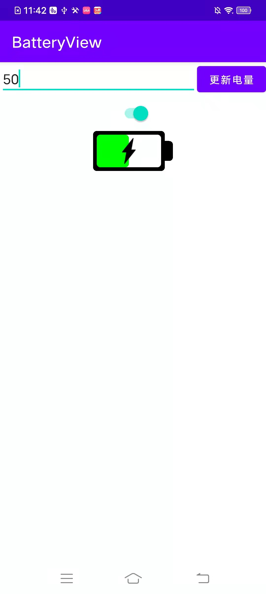

## 自定义电池电量显示组件

### 支持特性如下:

| 属性 | 类型 |说明 |
|-------| ------- |------- |
|battery_charge_drawable|reference|充电中标记drawable,默认null|
|battery_frame_color|int|描边颜色,默认black|
|battery_frame_width|dimension|描边宽度,默认5px|
|battery_electrode_width_ratio|float|电极头所占总宽度百分比,默认0.1|
|battery_electrode_height_ratio|float|电极头所占高度百分比,默认0.5|
|battery_full_color|color|电量区域充填颜色,默认#00ff00|
|battery_empty_color|color|电量区域充填背景色，默认#ffffff|
|battery_corner|dimension|圆角尺寸,默认10px|
|battery_power|int|电量值,范围0-100,默认0|
|battery_is_charge|boolean|是否正在充电,默认false|
|battery_auto_observe|boolean|是否自动监听电池变化,默认true|

## 项目依赖
[](https://jitpack.io/#Savion1162336040/batteryView)
### Step 1. Add it in your root build.gradle at the end of repositories
```
allprojects {
	repositories {
		...
		maven { url 'https://jitpack.io' }
	}
}
```
### Step 2. Add the dependency
```
dependencies {
    implementation 'com.github.Savion1162336040:batteryview:1.0'
}
```

